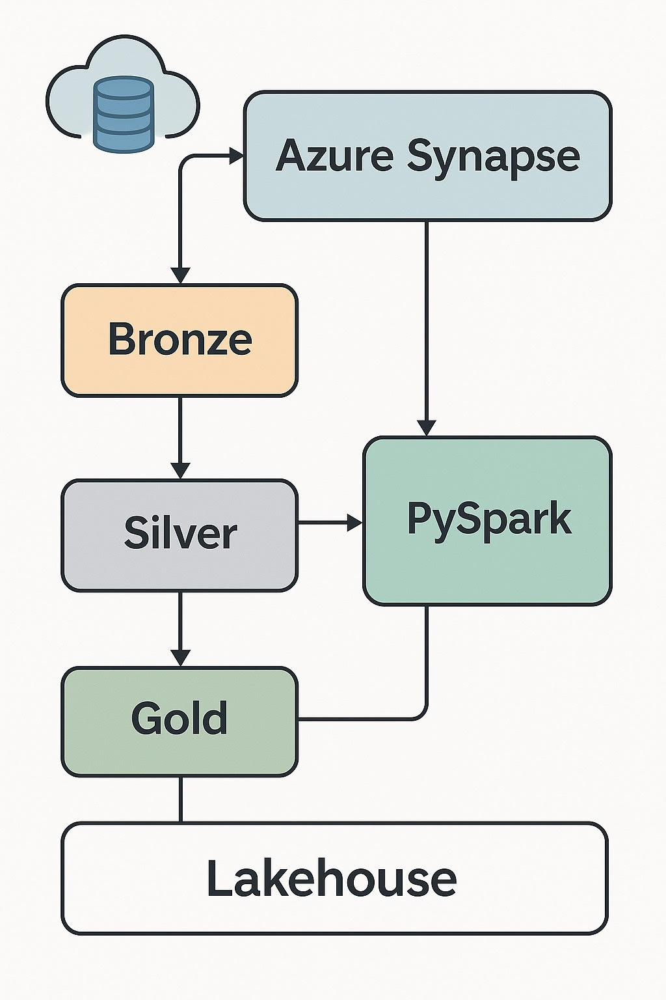

# Azure Lakehouse Project

**Owner:** Ruth Kumar (ruthkmr27)
**Repo:** azure-lakehouse-project

## Project overview
Small end-to-end demo of a Lakehouse on Azure using:
- ADLS Gen2 (storage)
- Azure Synapse (notebooks / Spark pool)
- Delta format for silver/gold layers
- Example ETL notebooks to move data Bronze → Silver → Gold

---

## Repository structure

/

├─ notebooks/                 # Synapse notebooks (PySpark .ipynb)

│  ├─ NB_BronzeToSilver.ipynb

│  ├─ NB_SilverToGold.ipynb

│  └─ NB_Gold_DimModel.ipynb

├─ architecture/              # Architecture diagrams and images

│  └─ diagram.png

├─ screenshots/               # Optional screenshots from Synapse UI

├─ README.md                  # This file

├─ LICENSE                    # MIT license

└─ .gitignore


---

## What’s included
- Notebooks that show:
- **Bronze**: ingest CSVs into the lake (raw).
- **Silver**: cleaning, dedupe, rename columns, basic transformations.
- **Gold**: write curated datasets (Delta / Parquet) and build a small dimensional model.
- Architecture diagram illustrating the Synapse workspace, ADLS Gen2, Spark pools, and data flow.
- Basic instructions to run the notebooks in an Azure Synapse environment.

---

## Prerequisites
- Azure subscription (free trial or paid) with enough quota to create a Synapse workspace and Spark pool.
- ADLS Gen2 storage account accessible by your Synapse workspace.
- A Synapse workspace with a Spark pool configured (or permissions to create one).
- Python / PySpark knowledge for running notebooks.


## How to run (high level)
1. Create an Azure Resource Group and an ADLS Gen2 storage account.
2. Create an Azure Synapse workspace and attach the storage account.
3. Create a Spark pool or ensure one exists.
4. Upload the sample CSV to the `bronze/` path in the ADLS container (or update `bronze_path` variable in the notebooks).
5. Open Synapse Studio → Develop → Notebooks. Upload or create the notebooks, attach them to the Spark pool, and run cells in order:
- `NB_BronzeToSilver.ipynb` (ingest raw CSV → silver)
- `NB_SilverToGold.ipynb` (transform silver → gold)
- `NB_Gold_DimModel.ipynb` (build dimension model)
6. Verify outputs in the lakehouse container (silver/ and gold/ paths).


  ## How to run (quick)
1. In Synapse Studio, open the notebook `notebooks/NB_BronzeToSilver.ipynb`.
2. Attach to your Spark pool (select a small pool or low-vcore configuration).
3. At top of each notebook edit the path variables to match your storage (example below).

Example variables (update per your environment):
```python
bronze_path = "abfss://lakehouse@<your_account>.dfs.core.windows.net/bronze/customers_raw/customers.csv"
silver_path = "abfss://lakehouse@<your_account>.dfs.core.windows.net/silver/customers/"
gold_path = "abfss://lakehouse@<your_account>.dfs.core.windows.net/gold/customers_model/"


Run cells sequentially:
- BronzeToSilver: ingest raw CSV → writes Delta to `silver_path`
- SilverToGold: transformations, dedupe, type-casting → writes Delta to `gold_path`
- Gold_DimModel: create small dimensional model or query the gold table

**If you don’t want to use ADLS right now**: upload the sample CSV in `notebooks/sample_data/customers_sample.csv` and point `bronze_path` to that file (web URL or storage path).

---

## Goals / Learning outcomes
- Build a simple lakehouse (bronze/silver/gold) in Azure Synapse with ADLS Gen2
- Learn Spark notebook development and small Delta writes/reads
- Understand minimal cost-control steps and workspace cleanup

## Notebooks summary
- **NB_BronzeToSilver.ipynb** — reads CSV from `abfss://.../bronze/`, does cleaning, renames columns, writes Delta/Parquet to silver.
- **NB_SilverToGold.ipynb** — aggregates/cleans silver data and writes final gold tables.
- **NB_Gold_DimModel.ipynb** — illustrative dimensional model SQL queries and example reads.

Each notebook contains the paths as variables at the top. Update `bronze_path`, `silver_path`, `gold_path` to match your ADLS container.

---

## Cost control & cleanup (important)
To avoid unexpected charges:
1. **Stop or delete Spark pools** when not in use:
- Synapse Studio → Manage → Apache Spark pools → select pool → Delete.
2. **Pause or delete dedicated SQL pools** (if created).
3. **Delete the Synapse workspace** if you’re finished.
4. **Delete the resource group** to remove all resources in one go (effective but irreversible).
5. Set resource tags and budgets in Azure Cost Management and create cost alerts.

I recommend deleting compute (Spark pools and SQL pools) at the end of every day if you are on a trial subscription.


## License
This repository is licensed under the MIT License — see `LICENSE` for details.

---

## Contact
Author: Ruth Kumar — `annie.data.engineer@outlook.com` (repo owner)
If you want: add LinkedIn/github/email contact information here.




